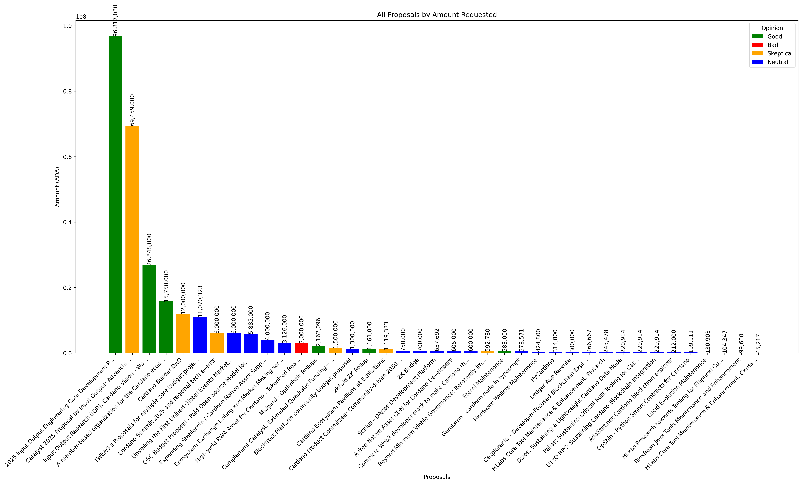
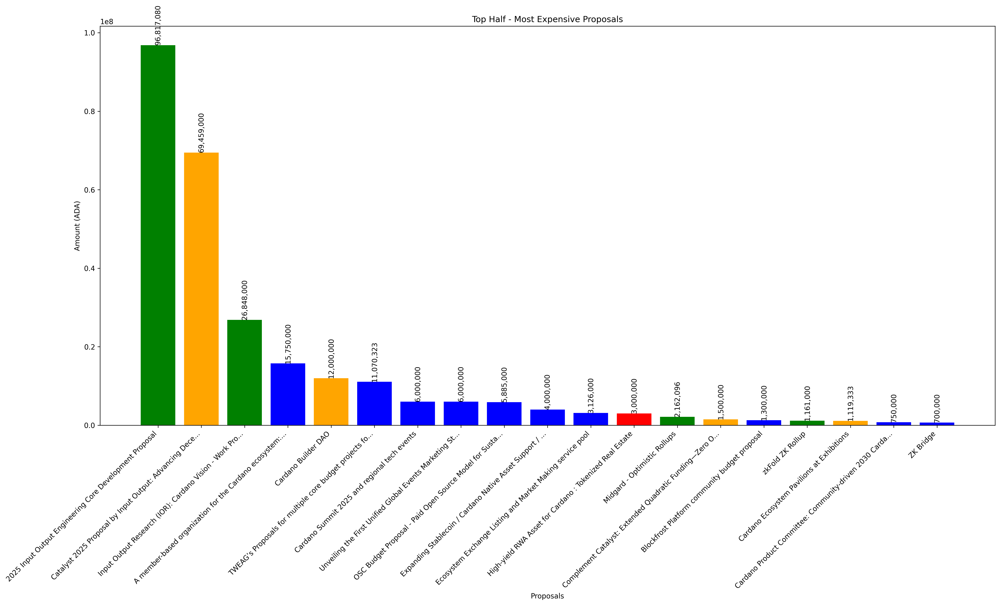
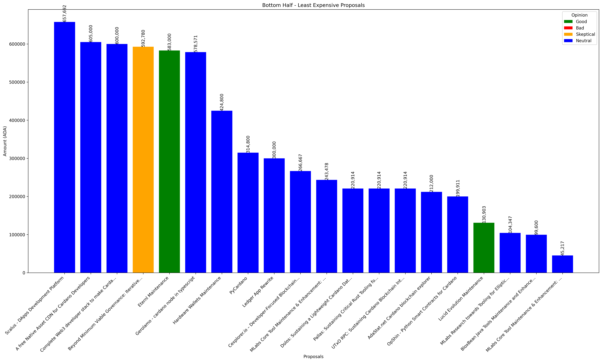

# Intersect Budget Analysis 2025

This project analyzes and visualizes the budget requests from Cardano proposals. The analysis includes three different views of the proposal amounts to help understand the distribution of funding requests.

## Generated Charts

### All Proposals

### Top Half - Most Expensive Proposals

### Bottom Half - Least Expensive Proposals

## Running the Analysis

To generate these charts, run the analysis script. The charts will be generated in the `charts` directory. 