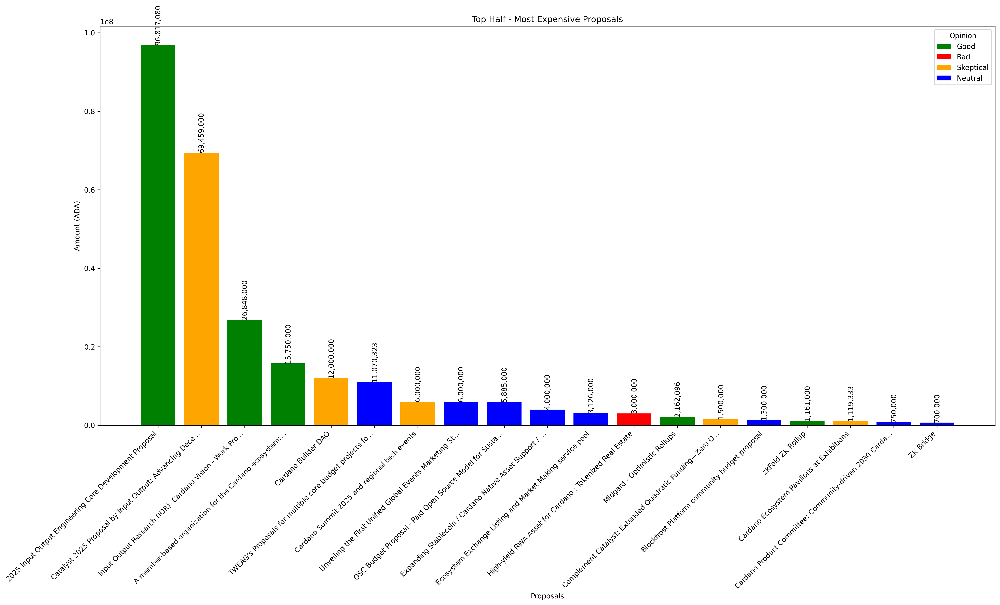

# Intersect Budget Analysis 2025

This project analyzes and visualizes the budget requests from Cardano proposals. The analysis includes multiple views of the proposal amounts and opinion distributions to help understand the funding requests and their categorization.

## Generated Charts

### Opinion Distribution

This visualization shows two pie charts:
- Left: Distribution of opinions by number of proposals
- Right: Distribution of opinions by total amount requested (ADA)

### All Proposals

### Top Half - Most Expensive Proposals

### Bottom Half - Least Expensive Proposals

## Running the Analysis

To generate these charts, run the analysis script. The charts will be generated in the `charts` directory. 